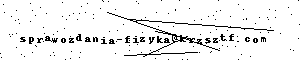

# polsl-sprawozdania-fizyka

*Zobacz też: [polsl-sprawozdania-tuc](https://github.com/krzsztfwtk/polsl-sprawozdania-tuc)*

W tym repozytorium znajdziesz przykładowe sprawozdania👩‍🔬 z eksperymentów fizycznych, realizowanych na laboratoriach fizyki🔬 na Informatyce💻 - Semestr 3 na Politechnice Śląskiej🎓 Dodaję tu tylko sprawdzone i ocenione pozytywnie sprawozdania✅.

## Eksperymenty 🧪

1. [Wyznaczanie przyspieszenia ziemskiego metodą wahadła matematycznego.](./sources/wyznaczanie_przyspieszenia_ziemskiego_metoda_wahadla_matematycznego.pdf)  🌍
2. [Wyznaczanie współczynnika lepkości powietrza metodą kapilarną.](./sources/wyznaczanie_wspolczynnika_lepkosci_powietrza_metoda_kapilarna.pdf)  💧
3. [Wyznaczanie ładunku właściwego elektronu metodą poprzecznego pola magnetycznego (lampa Thomsona).](./sources/wyznaczanie_ladunku_wlasciwego_elektronu_metoda_poprzecznego_pola_magnetycznego_lampa_thomsona.pdf)  🧲
4. [Badanie rezonansu w szeregowym obwodzie LC.](./sources/badanie_rezonansu_w_szeregowym_obwodzie_lc.pdf)  🔊
5. [Badanie zjawiska Halla.](./sources/badanie_zjawiska_halla.pdf)  📡
6. [Wyznaczanie szerokości przerwy energetycznej półprzewodnika metodą termiczną (termistor).](./sources/wyznaczanie_szerokosci_przerwy_energetycznej_polprzewodnika_metoda_termiczna_termistor.pdf)  🔥
7. [Wyznaczanie charakterystyk fotodiody.](./sources/wyznaczanie_charakterystyk_fotodiody.pdf)  🌟
8. [Wyznaczanie współczynnika załamania światła metodą pryzmatu.](./sources/wyznaczanie_wspolczynnika_zalamania_swiatla_metoda_pryzmatu.pdf)  🔍
9. [Wyznaczanie maksymalnej energii promieniowania beta metodą absorpcyjną.](./sources/wyznaczanie_maksymalnej_energii_promieniowania_beta_metoda_absorpcyjna.pdf)  ☢️
10. [Badania fotokomórki.](./sources/wyznaczanie_charakterystyk_fotokomorki_gazowanej.pdf)  📸
11. [Drgania relaksacyjne.](./sources/badanie_drgan_relaksacyjnych_w_ukladzie_rc.pdf)  ⏱️
12. [Pomiar prędkości dźwięku w powietrzu - rura Quinckego.](./sources/wyznaczanie_predkosci_dzwieku_w_powietrzu_metoda_rezonansowa_quincky_ego.pdf)  🎵

### Uwagi

- W repozytorium zamieszczone są wyłącznie obliczenia i analiza danych 📊. Wstępy teoretyczne zostały pominięte, gdyż teorię dobrze opisaną można znaleźć w odpowiednich źródłach takich jak [OpenStax](https://openstax.org/subjects/science), gdzie dostępne są darmowe podręczniki.
- Na wykresach czasami pojawiają się opisy np. `f=I(U)`. Te opisy nie są potrzebne, ponieważ widać to na poprawnie oznaczonych osiach.
- Na legendach do wykresów pojawia się zapis naukowy (np. `1.23e+04`). Lepiej używać zwykłego zapisu wykładniczego np.: **1.23 × 10⁴**
- Dziękuję za zainterowanie, którym cieszy się repozytorium. Jeśli uznasz je za przydatne, zachęcam do zostawienia gwiazdki.
- Proszę nie pisać do mnie z próśbami o `bezinteresowną` pomoc w przygotowywaniu sprawozdań. Jestem zaangażowany we własne projekty i nie dysponuję wystarczającą ilością wolnego czasu, aby `bezinteresownie` pomagać każdemu, kto do mnie napisze, w obliczeniach, interpretacji danych czy przygotowywaniu wykresów.
- Najlepiej wykonane są sprawozdania do tematów 4, 5, 11.
- Najgorzej wykonane jest sprawozdanie do tematu 7.

## Jak Korzystać z Repozytorium ❓

Każdy plik PDF związany z konkretnym eksperymentem możesz pobrać, klikając na odpowiedni link powyżej.

## Kontakt 📬

Jeśli masz pytania, sugestie lub widzisz błąd, nie wahaj się utworzyć 'Issue' na GitHubie.
Jeżeli potrzebujesz dedykowanej pomocy napisz tutaj:

